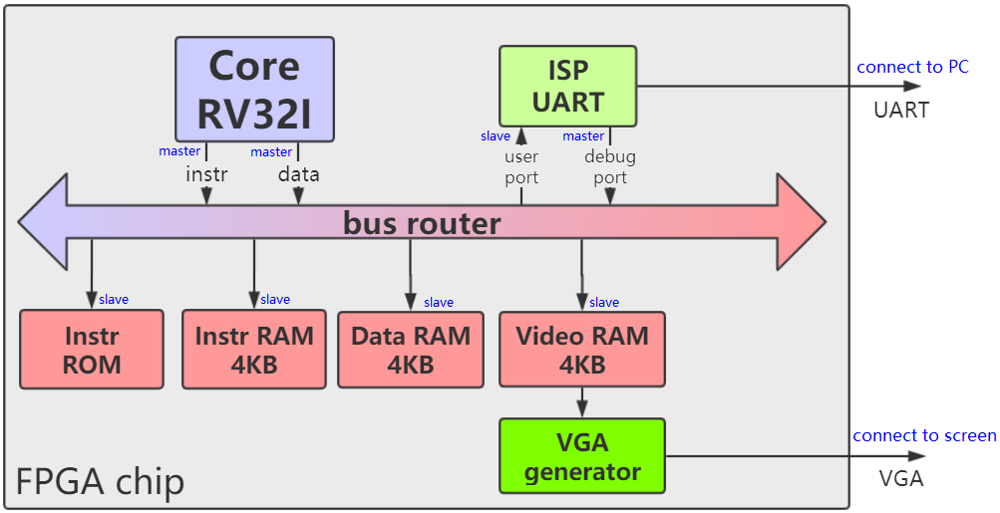
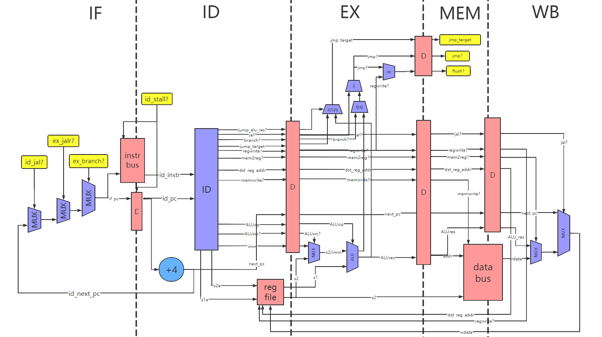
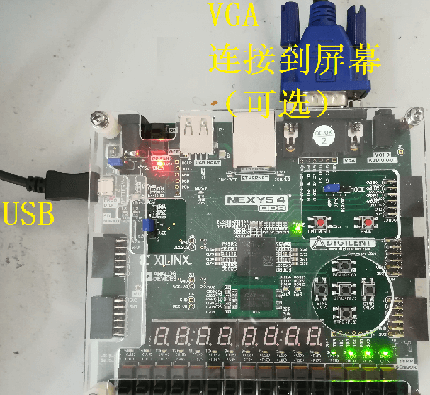
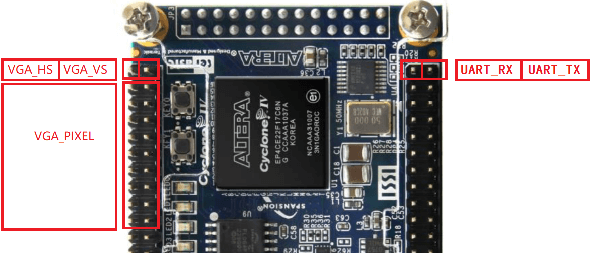
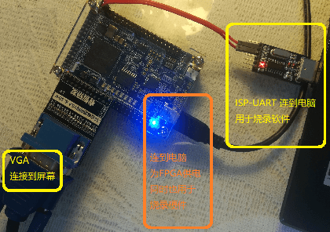
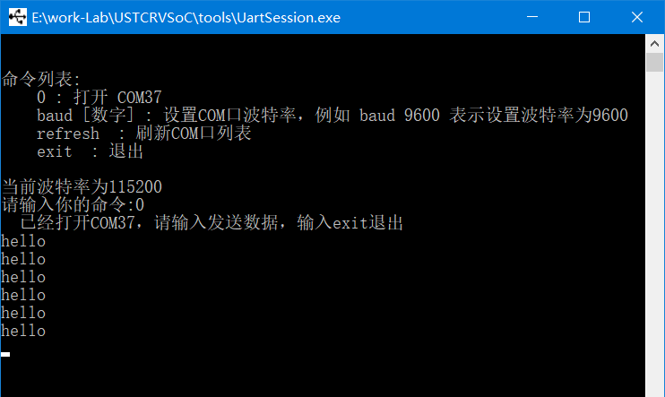
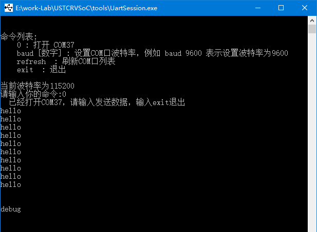
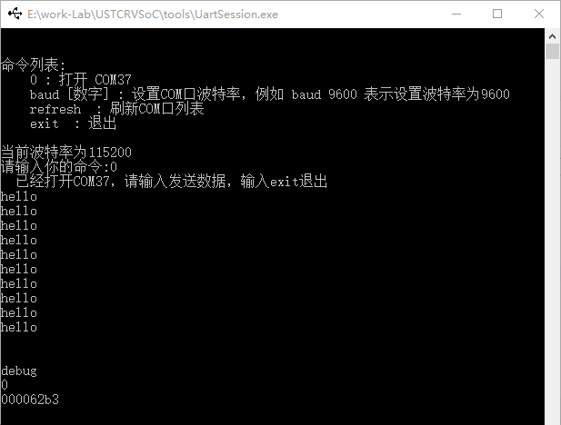
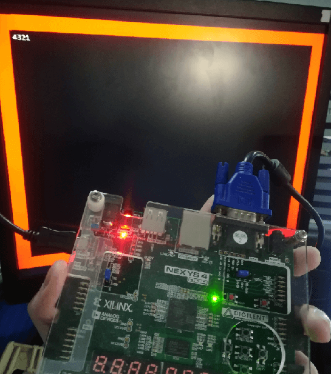
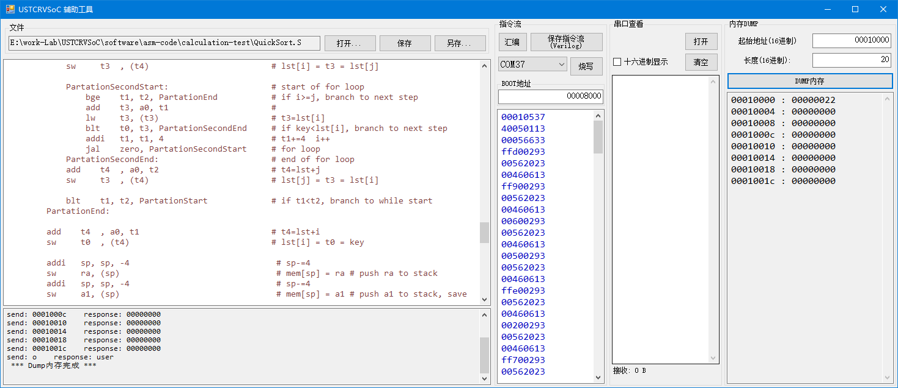

-CAD09D.svg)   

中文 | [English](#en)

USTCRVSoC
===========================

一个 SystemVerilog 编写的，以一个 RISC-V CPU 为核心的，普林斯顿结构的 SoC ，可作为 MCU 使用。

* **CPU**：5段流水线 RISC-V ，支持 **RV32I** 指令集（除了 CSR 指令）。
* **总线**：具有**握手机制**，32-bit地址，32-bit数据。
* **总线交叉开关 (bus router)**：可使用参数修改总线主从接口的数量和从接口占用的地址空间，以方便拓展外设。
* **交互式 UART 调试**：可使用PC上的 Putty、minicom、超级终端等软件进行在线系统复位**、**上传程序**、**查看内存。
* 完全使用 SystemVerilog 实现，不调用IP核，便于移植和仿真。

## 目录

* [简介](#简介)
* [硬件设计代码](#硬件设计代码)
* [部署到FPGA](#部署到FPGA)
    * 部署到 Nexys4
    * 部署到 Arty7
    * 部署到 DE0-Nano
    * 部署到其它开发板
* [运行与测试](#运行与测试)
    * Hello World
    * 使用 UART 调试总线
    * 使用 VGA 屏幕
    * 使用工具：USTCRVSoC-tool
* [CPU仿真](#CPU仿真)
* [SoC仿真](#SoC仿真)

# 简介

**图1**展示了SoC的结构，总线仲裁器 **bus_router** （也叫总线交叉开关）上挂载了3个**主接口**（master port）和5个**从接口**（slave port）。这个总线并不来自于任何现有标准（例如 AXI 或 APB），而是一种简单的同步握手总线，命名为 **naive_bus**。

|  |
| :-----------------------: |
|     **图1**：SoC 结构     |

每个**从接口**都占有一段地址空间。当**主接口**访问总线时，**bus_router**判断该地址属于哪个地址空间，然后将它**路由**到相应的**从接口**。下表展示了5个**从接口**的地址空间。

*表1*：SoC 地址空间分配

| 外设名称 | 起始地址    | 结束地址    |
| :-----:  | :-----:    | :----:     |
| Instr ROM（指令ROM） | 0x00000000 | 0x00007fff |
| Instr RAM（指令RAM） | 0x00008000 | 0x00008fff |
| Data RAM（数据RAM） | 0x00010000 | 0x00010fff |
| Video RAM（显存RAM） | 0x00020000 | 0x00020fff |
| ISP UART's user port | 0x00030000 | 0x00030003 |

## 组成部件

* **多主多从总线仲裁器 (bus_router)**：对应文件 naive_bus_router.sv。为每个从设备划分地址空间，将主设备的总线读写请求路由到从设备。当多个主设备同时访问一个从设备时，还能根据主设备的优先级进行冲突仲裁。
* **RV32I Core**：对应文件 core_top.sv。包括两个主接口。一个用于取指令，一个用于读写数据。
* **UART调试器**：对应文件 isp_uart.sv。将UART调试功能和用户UART结合为一体。包括一个主接口和一个从接口。它接收上位机从UART发来的命令，对总线进行读写。它可以用于在线烧写、在线调试。也可以接收CPU的命令去发送数据给用户。
* **指令ROM**：对应文件 instr_rom.sv。CPU默认从这里开始取指令，里面的指令流是在硬件代码编译综合时就固定的，不能在运行时修改。唯一的修改方法是编辑 **instr_rom.sv** 中的代码，然后重新编译综合、烧写FPGA逻辑。因此**instr_rom** 多用于仿真。
* **指令RAM**：对应文件 ram_bus_wrapper.sv。请使用UART调试器在线烧写指令流到这里，然后将 Boot 地址指向这里，再复位SoC后，CPU就从这里开始运行指令流。
* **数据RAM**：对应文件 ram_bus_wrapper.sv。存放运行时的数据。
* **显存RAM**：对应文件 video_ram.sv。在屏幕上显示 86列 * 32行 = 2752 个字符，显存 RAM 的 4096B 被划分为 32 个块，每块对应一行，占 128B，前 86 字节对应 86 个列。屏幕上显示的是每个字节作为 ASCII 码所对应的字符。

## CPU特性

* 支持： **RV32I** 中的所有 Load、Store、算术、逻辑、移位、比较、跳转。
* 不支持：控制状态（CSR）、同步、环境调用和断点类指令

所有支持的指令包括：

> LB, LH, LW, LBU, LHU, SB, SH, SW, ADD, ADDI, SUB, LUI, AUIPC, XOR, XORI, OR, ORI, AND, ANDI, SLL, SLLI, SRL, SRLI, SRA, SRAI, SLT, SLTI, SLTU, SLTIU, BEQ, BNE, BLT ,BGE, BLTU, BGEU, JAL, JALR

CPU采用5段流水线，如**图2**，目前支持的流水线特性包括：Forward、Loaduse、总线握手等待。

|  |
| :-----------------------: |
|     **图2**：CPU 结构     |


# 硬件设计代码

| 目录名       | 说明                                                         |
| ------------ | ------------------------------------------------------------ |
| RTL          | 全部的 SystemVerilog 代码，其中 soc_top.sv 是整个 SoC 的顶层 |
| FPGA-Arty7   | 基于 Arty7 开发板的 Vivado 工程                              |
| FPGA-Nexys4  | 基于 Nexys4 开发板的 Vivado 工程                             |
| FPGA-DE0Nano | 基于 DE0Nano 开发板的 Quartus 工程                           |
| SIM-CPU      | 仿真：对 CPU 进行的指令集测试（使用 RISC-V 官方测试程序）    |
| SIM-SoC      | 仿真：对整个 SoC 的仿真                                      |

请注意，所有工程共用 RTL 目录，因此在一个工程里修改代码也会导致其它工程中的代码发生变化。


# 部署到FPGA

目前，我提供了 Xilinx 的 **Nexys4 开发板** 、 **Arty7 开发板** 和 Altera 的 **DE0-Nano 开发板** 的工程。

为了进行部署和测试，你需要准备以下的东西：

* **Windows7 系统** 或更高版本的 PC（如果使用 Linux 则很难用上我提供的两个C\#编写的工具）
* **Nexys4 开发板** 或 **Arty7 开发板** 或 **DE0-Nano 开发板** 或其它 FPGA 开发板
  * 如果你的开发板没有自带 USB 转 UART 电路（例如 DE0-Nano），则需要一个 **USB转UART模块**

* 开发板对应的开发环境，例如 Nexys4 和 Arty7 开发板对应 Vivado，DE0-Nano 对应 Quartus
* 可选：屏幕、VGA线

## 部署到 Nexys4

|  |
| :---------------------------------------------------: |
|            **图3**：Nexys4 的硬件连接方法             |

1. **硬件连接**：如**图3**，Nexys4 开发板上有一个 USB 口，既可以用于 FPGA 烧录，也可以用于 UART 通信，我们需要连接该 USB 口到电脑。另外，VGA 的连接是可选的，你可以把它连接到屏幕上。
2. **综合、烧写**：请用 Vivado 打开工程 **FPGA-Nexys4/USTCRVSoC-nexys4.xpr** 。综合并烧写。

## 部署到 Arty7

1. **硬件连接**：Arty7 开发板上有一个 USB 口，既可以用于 FPGA 烧录，也可以用于 UART 通信，我们需要连接该 USB 口到电脑。
2. **综合、烧写**：请用 Vivado 打开工程 **FPGA-Arty7/USTCRVSoC-Arty7.xpr** 。综合并烧写。

## 部署到 DE0-Nano

|  |
| :---------------------------------: |
|  **图4**：DE0-Nano 的硬件连接方法   |

1. **硬件连接**：DE0-Nano开发板上既没有USB转UART，也没有VGA接口。因此需要外部模块，以及一些动手能力。我们使用DE0-Nano上的两排GPIO作为外接模块的引脚，接口含义如**图4**。你需要一个USB转UART的模块，将UART的TX和RX引脚连接上去，使之能与电脑通信。VGA的连接是可选的，需要符合上图中VGA的引脚定义。最后连接的效果如**图5**。
2. **综合、烧写**：请用 Quartus 打开 **FPGA-DE0Nano/DE0Nano_USTCRVSoC.qpf**。综合并烧写。

|  |
| :-----------------------------------------------------: |
|              **图5**：DE0-Nano 的硬件连接               |

## 部署到其它开发板

如果你手头的 FPGA 开发板不是上述开发板，则需要手动建立工程，连接信号到开发板顶层。分为以下步骤：

1. **建立工程**：建立工程后，需要将 RTL 目录（以及其子目录）中的所有 .sv 文件添加进工程。
2. **编写顶层**：SoC 的顶层文件是 **soc_top.sv**，你需要编写一个针对该开发板的顶层文件，调用 **soc_top**，并将 FPGA 的引脚连接到 **soc_top** 中。以下是对 **soc_top** 的信号说明。
3. **综合、烧写到FPGA**

```Verilog
module soc_top  #(
  // UART接收分频系数，请根据clk的时钟频率决定，计算公式 UART_RX_CLK_DIV=clk频率(Hz)/460800，四舍五入
  parameter  UART_RX_CLK_DIV = 108,
  // UART发送分频系数，请根据clk的时钟频率决定，计算公式 UART_TX_CLK_DIV=clk频率(Hz)/115200，四舍五入
  parameter  UART_TX_CLK_DIV = 434,
  // VGA分频系数，请根据clk的时钟频率决定，计算公式 VGA_CLK_DIV=clk频率(Hz)/50000000
  parameter  VGA_CLK_DIV     = 1
)(
  input  logic clk,            // SoC 时钟，推荐使用 50MHz 的倍数
  input  logic isp_uart_rx,    // 连接到开发板的 UART RX 引脚
  output logic isp_uart_tx,    // 连接到开发板的 UART TX 引脚
  output logic vga_hsync, vga_vsync,   // 连接到VGA（可以不连接）
  output logic vga_red, vga_green, vga_blue   // 连接到VGA（可以不连接）
);
```


# 运行与测试

硬件烧写后，开始对它进行测试。

### Hello World

硬件烧写后，就已经能看到 UART_TX 对应的指示灯在闪烁，每闪烁一下其实是在通过UART发送一个"Hello"，这说明CPU在运行指令ROM里默认的程序。下面我们来查看这个 Hello。

首先我们需要一款**串口终端软件**，例如：
* minicom
* 串口助手
* 超级终端（HyperTerminal）
* Putty

这些工具用起来都不够爽快，因此这里使用该仓库中自带的小工具 **UartSession** 做示范。它的路径是 **./UartSession/UartSession.exe **，直接双击打开。

首先，我们双击运行 **UartSession.exe**，可以看到该软件将电脑的所有可用端口都列了出来，并给出了几个选项：

- **打开端口**：输入数字，按回车可以打开数字对应的端口。

- **修改波特率**：输入"baud [数字]"，再按回车可以修改波特率。例如输入baud 9600可以修改波特率为9600。

- **刷新端口列表**：输入"refresh"，再按回车可以刷新端口列表。

- **退出**：输入"exit"可以退出

波特率默认是115200，与我们的 SoC 一致，不需要修改。我们直接从端口列表里找到 FPGA 开发板所对应的COM端口，打开它。我们就可以看到窗口中不断显示"hello"，根本停不下来，如**图6**，这说明CPU在正常运行程序。

|         |
| :------------------------------------------------: |
| **图6**：打开COM端口后，可以看到不断地打印出 hello |

> 提示：如果不知道端口列表中哪个端口对应 FPGA 开发板，可以拔下开发板的 USB，刷新一次端口列表，则消失的端口就是开发板对应的端口。然后再插上USB（如果FPGA内的电路丢失则需要重新烧录FPGA）


### 使用 UART 调试总线

现在界面中不断地打印出"hello"，我们打一个回车，可以看到它不再打出"hello"，并出现了一个"debug"，这样就成功进入了 **DEBUG模式**，如**图7**。

|  |
| :-----------------------------------------: |
|            **图7**：进入调试模式            |

SoC 内的 UART 调试器（isp_uart.sv）有两种模式：
* **USER 模式**：该模式下可以收到 CPU 通过 isp_uart 发送的用户打印数据。FPGA烧写后默认处于这个模式。hello只有在这个模式下才能被我们看到。通过向 uart **发送一个\n** 可以跳出 **USER模式**，进入DEBUG模式。
* **DEBUG 模式**：该模式下 CPU 打印的任何数据都会被抑制，UART 不再主动发送数据，变成了**一问一答**的形式，用户发送的调试命令和接收到的应答都**以\n结尾**，通过发送"o"可以回到 **USER模式**。

下面让我们尝试在 **DEBUG 模式**下对总线进行读写。如**图8**，输入 **"0"** 并按回车，会看到对方发来一个8位16进制数。该数就是SoC总线的地址 0x00000000 处读取出的数据。从表1可以看出，它是**指令ROM**中的第一条指令。

|  |
| :-----------------------------------------: |
|     **图8**：在调试模式下进行总线读操作     |

除了读，我们也可以在总线上进行写操作。我们输入一条写命令 "10000 abcd1234" 并按回车，会看到对方发来 "wr done" ，意为写成功，该命令意为向地址 0x10000 中写入 0xabcd1234（从表1可以看出，0x10000是数据RAM的首地址）。

为了验证写成功，输入读命令 "10000" 并按回车，会看到对方发来 "abcd1234" 。

> 注：UART 调试器每次读写总线只能以**4字节对齐**的形式，并且一次必须读写4字节。

下表显示了 **DEBUG模式** 的所有命令格式。

| 命令类型  | 命令示例   | 返回示例  | 含义        |
| -----  | :-----    | :----     | :-----   |
| 读总线  | 00020000 | abcd1234 | 地址0x00020000读出的数据是0xabcd1234 |
| 写总线  | 00020004 1276acd0 | wr done | 向地址0x00020004写数据0x1276acd0 |
| 切至USER模式 | o   | user | 切换回USER模式|
| 复位  | r00008000 | rst done | CPU 复位并从地址 0x00008000 处开始执行，同时切换回 USER 模式 |
| 非法命令  | ^^$aslfdi | invalid | 发送的命令未定义 |

> 注：无论是发送还是接收，所有命令都以\n或\r或\r\n结尾，**UartSession.exe**是自动插入\n的。如果使用串口助手等其它软件，需要注意这个问题。

根据这些命令，不难猜出，在线上传程序的流程是：

1. 使用写命令，将指令一条条地写入指令 RAM ，（指令 RAM 的地址空间是 00008000~00008fff）
2. 使用复位命令 r00008000 ，将 CPU 复位并从指令 RAM 中启动

### 使用 VGA 屏幕

没有连接屏幕的可以跳过这一步。

如果开发板通过 VGA 连接到了屏幕，可以看到屏幕上出现一个红框，里面空空如也。实际上里面隐藏了 86列32行的字符空位。下面用 **UART调试器** 让屏幕上显示字符。

> 提示：如果屏幕中的红框不在正中间，可以使用屏幕的“自动校正”按钮校正一下

在**DEBUG模式**下，发送一条写命令： **"20000 31323334"** ，可以看到第一行出现了 **4321** 。这是因为显存RAM的起始地址是 0x20000，使用 UART调试器 正好向其中的前4个字节写入了 0x34、0x33、0x32、0x31，也就是**4321**的ASCII码。

显存 RAM 占 4096 字节，分为32个块，对应屏幕中的32个行；每块128B，前 86 字节对应该行中的前 86 个字符的 ASCII 码。后面128-86个字节不会显示在屏幕上。

显存 RAM 与 数据 RAM 行为相同，即可读又可写，但不能保证一个时钟周期一定能读出数据。

|                            |
| :------------------------------------------------------: |
| **图9**：用UART调试器向VGA显存中写入数据，显示在屏幕上。 |

### 使用工具：USTCRVSoC-tool

玩了好久的 UART 调试，也该进入正题了——用 CPU 跑 benchmark 。

**./asm-code** 目录中提供几个汇编语言的小程序作为 benchmark，如下表。

| 文件名   | 说明   |
| :-----  | :-----    |
| io-test/uart_print.S  | 用户UART循环打印hello, 即**指令ROM**中的程序 |
| io-test/vga_hello.S   | 屏幕上显示hello    |
| calculation-test/Fibonacci.S  | 递归法计算**斐波那契数列**第8个数  |
| calculation-test/Number2Ascii.S  | 将数字转化成ASCII字符串，类似于C语言中的 **itoa** 或 **sprintf %d** |
| calculation-test/QuickSort.S | 在RAM中初始化一段数据，并进行**快速排序** |
| basic-test/big_endian_little_endian.S | 测试这个系统是**大端序**还是**小端序**（这里自然是小端序） |
| basic-test/load_store.S | 完成一些内存读写 |

我们不可能一条一条地把编译得到的机器码手动写入指令RAM，这太麻烦了。为此，我提供了一个能进行汇编和在线写入指令流的工具：**USTCRVSoC-tool.exe** （它相当于一个汇编语言的IDE），路径是 **./USTCRVSoC-tool/USTCRVSoC-tool.exe**，双击它打开。

|  |
| :---------------------------------------: |
|      **图10**：USTCRVSoC-tool 的界面      |

现在我们尝试让SoC运行一个计算快速排序的程序。步骤：
1. **打开 USTCRVSoC-tool.exe**
2. **打开**：点击**打开**按钮，浏览到目录 ./asm-code/calculation-test/，打开汇编文件 **QuickSort.S**。
3. **汇编**：点击**汇编**按钮，可以看到下方框里出现了一串16进制数，这就是汇编得到的机器码。
4. **烧写**：确保FPGA连接到电脑并烧录了SoC的硬件，然后选择正确的 COM 端口，点击**烧写**，如果下方状态栏里显示“烧写成功”，则CPU就已经开始运行该机器码了。
5. **查看内存**：这时，在右侧点击**DUMP内存**，可以看到一个有序的数列。QuickSort程序对-9~+9的乱序数组进行了排序，每个数重复了两次。默认的**DUMP内存**不能显示完全，可以将长度设置为100，这样DUMP的字节数量为0x100字节，能看到排序的完整结果。

另外，**USTCRVSoC-tool** 也能查看USER模式下的串口数据。请打开 **io-test/uart_print.S**，汇编并烧写，可以看到右侧的**串口查看**框中不断的打印hello。

现在，你可以尝试运行这些汇编 benchmark，或者自己编写汇编进行测试。**Have fun!**

> 关于**普林斯顿结构**：我们虽然区分了**指令RAM**、**数据RAM**、**显存RAM**，但这写存储器在普林斯顿结构中都没有区别。你可以把指令烧写到**数据RAM**、**显存RAM**中去运行，也可以把变量放在**指令RAM**中。甚至，指令和数据都可以放在**数据RAM**中，只要地址别冲突，程序也能正常运行。但是这样的运行效率就会降低，因为CPU的**指令接口**和**数据接口**会**争抢总线**。


# CPU仿真

为了验证 CPU 是否能正确地支持 RV32I 指令集，我进行了 Verilog 仿真，在该仿真中，CPU 会运行 RISC-V 官方指令集测试程序。

该仿真的相关文件都在 SIM-CPU 目录中，其中的各文件说明如下：

| 文件/目录名 | 说明                                                         |
| ----------- | ------------------------------------------------------------ |
| tb_cpu.sv   | testbench代码                                                |
| vivado_sim  | Vivado 工程，调用 tb_cpu.sv 和 RTL 目录里的设计代码进行仿真。 |
| rv32i_test  | 包含三个测试程序的汇编代码和指令流                           |

要运行 CPU 仿真，请用 Vivado 打开工程 **SIM-CPU/vivado_sim/sim_cpu.xpr** ，可看见顶层文件为 **tb_cpu.sv** ，然后你可以修改参数 `INSTRUCTION_STREAM_FILE` 来指定让 CPU 运行哪个指令流（注意应该改成你的PC中的绝对路径）。这里我们应该运行 rv32i_test 目录里提供的三个测试程序：

- a_instr_stream.txt ：算术逻辑指令相关的测试。
- b_instr_stream.txt ：Load/Store 指令相关的测试。
- c_instr_stream.txt ：跳转指令相关的测试。

然后我们就可以在 Vivado 中运行行为仿真（Behavior Simulation），这三个测试程序在仿真时，大概需要运行 500us 就能结束，测试成功的标志是 gp 寄存器（3号寄存器，对应 core_regfile.sv 中的 regfile[3] 这个变量）变成 0x00000001 。


# SoC仿真

我还提供了 SoC 的整体仿真。

请用 Vivado 打开工程 **SIM-SoC/vivado_sim/sim_soc.xpr** ，可看见顶层文件为 **tb_soc.sv** ，可以直接进行行为仿真。

仿真时运行的指令流来自**指令ROM**，如果你还没修改过**指令ROM**，则仿真时可以看到 **uart_tx** 信号出现 **uart** 发送的波形，这是它在打印 **hello**。

如果你想在仿真时让 CPU 运行其它的指令流，需要对**指令ROM**进行修改。**USTCRVSoC-tool** 除了进行烧写，也可以用编译后的指令流生成**指令ROM**的Verilog代码。当你使用**汇编**按钮产生指令流后，可以点击右侧的"保存指令流(Verilog)"按钮，保存时替换掉 **./RTL/instr_rom.sv**，再重新进行仿真即可。


<span id="en">USTCRVSoC</span>
===========================

A Princeton-structured SoC written in SystemVerilog with a RISC-V CPU as the core, which can be used as an MCU.

* **CPU**: 5-stage pipeline RISC-V, support **RV32I** instruction set (except CSR instruction).
* **Bus**: with **handshake mechanism**, 32-bit address, 32-bit data.
* **Bus router**: You can use parameters to modify the number of bus master-slave interfaces and the address space occupied by the slave interfaces to facilitate the expansion of peripherals.
* **Interactive UART debugging**: You can use Putty, minicom, HyperTerminal and other software on the PC to perform online system reset**, **upload programs**, and **check memory.
* Completely implemented with SystemVerilog, without calling IP core, which is convenient for porting and simulation.

## Table of Contents

* [Introduction](#Introduction)
* [Design Code](#Design Code)
* [Deploy on FPGA](#Deploy on FPGA)
  * Deploy on Nexys4
  * Deploy on Arty7
  * Deploy on DE0-Nano
  * Deploy on other boards
* [Run and Test](#Run and Test)
  * Hello World
  * Use UART to debug
  * Use VGA screen
  * Use USTCRVSoC-tool
* [CPU Simulation](#CPU Simulation)
* [SoC Simulation](#SoC Simulation)

# Introduction

**Figure1** shows the structure of the SoC, the bus arbiter **bus_router** (also called bus crossbar) is mounted with 3 **master interfaces** (master port) and 5 **slave interfaces ** (slave port). This bus is not derived from any existing standard (such as AXI or APB), but is a simple synchronous handshake bus named **naive_bus**.

|     |
| :--------------------------: |
| **Figure1** : SoC structure. |

Each **slave interface** occupies a segment of address space. When the master interface accesses the bus, the bus_router determines which address space the address belongs to, and then routes it to the corresponding slave interface. The following table shows the address space of the 5 **slave interfaces**.

*Table1* : SoC address space allocation.

|      Peripheral      | start address | final address |
| :------------------: | :-----------: | :-----------: |
|   Instruction ROM    |  0x00000000   |  0x00007fff   |
|   Instruction RAM    |  0x00008000   |  0x00008fff   |
|       Data RAM       |  0x00010000   |  0x00010fff   |
|      Video RAM       |  0x00020000   |  0x00020fff   |
| ISP UART's user port |  0x00030000   |  0x00030003   |

## Components

* **Multi-master multi-slave bus arbiter (bus_router)**: Corresponding file naive_bus_router.sv. Divide the address space for each slave device, and route the bus read and write requests of the master device to the slave device. When multiple master devices access a slave device at the same time, conflict arbitration can also be performed according to the priority of the master device.
* **RV32I Core**: corresponds to the file core_top.sv. Includes two main interfaces. One for fetching instructions and one for reading and writing data.
* **UART Debugger**: Corresponding file isp_uart.sv. Combines UART debug function and user UART into one. Including a master interface and a slave interface. It receives the command sent by the host computer from the UART, and reads and writes the bus. It can be used for online programming and online debugging. It can also receive commands from the CPU to send data to the user.
* **Instruction ROM**: Corresponding file instr_rom.sv. The CPU starts fetching instructions from here by default, and the instruction stream inside is fixed when the hardware code is compiled and synthesized, and cannot be modified at runtime. The only way to modify it is to edit the code in **instr_rom.sv** and then recompile the synthesis and program the FPGA logic. So **instr_rom** is mostly used for simulation.
* **Instruction RAM**: Corresponding file ram_bus_wrapper.sv. Please use the UART debugger to program the instruction stream online, and then point the Boot address here. After resetting the SoC, the CPU starts to run the instruction stream from here.
* **Data RAM**: Corresponding file ram_bus_wrapper.sv. Store runtime data.
* **Video RAM**: Corresponding file video_ram.sv. Displaying 86 columns * 32 rows = 2752 characters on the screen, the 4096B of the video memory RAM is divided into 32 blocks, each block corresponds to a row, occupying 128B, and the first 86 bytes corresponds to 86 columns. What is displayed on the screen is the character corresponding to each byte as an ASCII code.

## CPU Features

* Supports: All Load, Store, Arithmetic, Logical, Shift, Compare, Jump in **RV32I**.
* Not supported: Control State (CSR), Synchronization, Environment Calls, and Breakpoints.

All supported directives include:

> LB, LH, LW, LBU, LHU, SB, SH, SW, ADD, ADDI, SUB, LUI, AUIPC, XOR, XORI, OR, ORI, AND, ANDI, SLL, SLLI, SRL, SRLI, SRA, SRAI , SLT, SLTI, SLTU, SLTIU, BEQ, BNE, BLT ,BGE, BLTU, BGEU, JAL, JALR

The CPU adopts a 5-stage pipeline, as shown in **Figure2**. The currently supported pipeline features include: Forward, Loaduse, and bus handshake waiting.

|     |
| :--------------------------: |
| **Figure2** : CPU structure. |


# Design Code

| Folder Name  | Description                                                  |
| ------------ | ------------------------------------------------------------ |
| RTL          | All SystemVerilog code, where soc_top.sv is the top level of the entire SoC. |
| FPGA-Arty7   | Vivado project based on Arty7 development board.             |
| FPGA-Nexys4  | Vivado project based on Nexys4 development board.            |
| FPGA-DE0Nano | Vivado project based on DE0Nano development board.           |
| SIM-CPU      | Simulation: Instruction set test for CPU using RISC-V official test program. |
| SIM-SoC      | Simulation for the SoC.                                      |

Note that all projects share the same RTL directory, so modifying code in one project will also change the code in other projects.


# Deploy on FPGA

Currently, I provide projects for Xilinx's **Nexys4 Development Board** , **Arty7 Development Board** and Altera's **DE0-Nano Development Board**.

To deploy, you need to prepare the following things:

* **Windows7 system** or higher PC (if you use Linux, it is difficult to use the two tools written in C\# that I provide).
* **Nexys4 board** or **Arty7 board** or **DE0-Nano board** or other FPGA board.
  * If your development board does not have a built-in USB to UART circuit (eg DE0-Nano), you will need a **USB to UART module**
* The development tool corresponding to the development board, such as Nexys4 and Arty7 corresponding to Vivado, DE0-Nano corresponding to Quartus.
* Optional: screen, VGA cable.

## Deploy on Nexys4

|  |
| :---------------------------------------------------: |
|     **Figure3** : hardware connection for Nexys4.     |

1. **Hardware connection**: As shown in **Figure3**, the Nexys4 development board has a USB port, which can be used for FPGA programming or UART communication. We need to connect the USB port to the computer. Also, the VGA connection is optional, you can connect it to the screen.
2. **Synthesis and programming**: Please use Vivado to open the project **FPGA-Nexys4/USTCRVSoC-nexys4.xpr** . Synthesize and program to FPGA.

## Deploy on Arty7

1. **Hardware connection**: There is a USB port on the Arty7 development board, which can be used for FPGA programming or UART communication. We need to connect the USB port to the computer.
2. **Synthesis and programming**: Please use Vivado to open the project **FPGA-Arty7/USTCRVSoC-Arty7.xpr** . Synthesize and program to FPGA.

## Deploy on DE0-Nano

|              |
| :---------------------------------------------: |
| **Figure4** : hardware connection for DE0-Nano. |

1. **Hardware connection**: There is neither USB to UART nor VGA port on the DE0-Nano development board. Hence the need for external modules. We use the two rows of GPIO on DE0-Nano as the pins of the external module, and the meaning of the interface is shown in **Figure4**. You need a USB to UART module, connect the TX and RX pins of the UART, so that it can communicate with the computer. The connection of VGA is optional and needs to conform to the pin definition of VGA in the above figure. The effect of the final connection is as shown in **Figure5**.

2. **Synthesis and programming**: Please open **FPGA-DE0Nano/DE0Nano_USTCRVSoC.qpf** with Quartus. Synthesize and program to FPGA.

|  |
| :-----------------------------------------------------: |
|     **Figure5** : hardware connection for DE0-Nano.     |

## Deploy on other boards

If your FPGA development board is not the above development board, you need to manually build the project and connect the signals to the top layer of the development board. Divided into the following steps:

1. **Build project**: After building the project, you need to add all the .sv files in the RTL directory (and its subdirectories) into the project.
2. **Write the top-level**: The top-level file of the SoC is **soc_top.sv**, you need to write a top-level file for FPGA, call **soc_top**, and connect the pins of the FPGA to **soc_top**. The following is the signal description for **soc_top**.
3. **Synthesis and programming to FPGA**

```Verilog
module soc_top  #(
  // UART接收分频系数，请根据clk的时钟频率决定，计算公式 UART_RX_CLK_DIV=clk频率(Hz)/460800，四舍五入
  parameter  UART_RX_CLK_DIV = 108,
  // UART发送分频系数，请根据clk的时钟频率决定，计算公式 UART_TX_CLK_DIV=clk频率(Hz)/115200，四舍五入
  parameter  UART_TX_CLK_DIV = 434,
  // VGA分频系数，请根据clk的时钟频率决定，计算公式 VGA_CLK_DIV=clk频率(Hz)/50000000
  parameter  VGA_CLK_DIV     = 1
)(
  input  logic clk,            // SoC 时钟，推荐使用 50MHz 的倍数
  input  logic isp_uart_rx,    // 连接到开发板的 UART RX 引脚
  output logic isp_uart_tx,    // 连接到开发板的 UART TX 引脚
  output logic vga_hsync, vga_vsync,   // 连接到VGA（可以不连接）
  output logic vga_red, vga_green, vga_blue   // 连接到VGA（可以不连接）
);
```


# Run and Test

After the FPGA is programmed, start to test it.

### Hello World

After the hardware is programmed, you can already see that the indicator light corresponding to UART\_TX is blinking. Each blink is actually sending a "Hello" through the UART, which means that the CPU is running the default program in the command ROM. Let's take a look at this Hello.

First of all, we need a **serial terminal software**, such as:

* minicom
* Serial Assistant
* HyperTerminal
* Putty

Above softwares are not convenient enough to use, so here I provide a small tool **UartSession** . It's in path **./UartSession/UartSession.exe** .

First, we double-click to run **UartSession.exe**, you can see that the software lists all the available ports of the computer, and gives several options:

- **Open port**: Enter a number and press Enter to open the port corresponding to the number.

- **Modify baud rate**: Enter `baud [number]` and press Enter to modify the baud rate. For example, enter baud 9600 to modify the baud rate to 9600.

- **Refresh Port List**: Enter `refresh` and press Enter to refresh the port list.

- **Exit**: Enter "exit" to exit

The default baud rate is 115200, which is consistent with our SoC and does not need to be modified. We directly find the COM port corresponding to the FPGA development board from the port list and open it. We can see that "hello" is continuously displayed in the window, as shown in **Figure6**, which indicates that the CPU is running the program in the Instruction ROM normally.

|                   |
| :----------------------------------------------------------: |
| **Figure6** : After opening the COM port, you can see that hello is continuously printed out |

> **Hint** : If you don't know which COM port in the port list corresponds to the FPGA development board, you can unplug the USB of the development board and refresh the port list once, and the port that disappears is the port corresponding to the development board. Then plug in the USB (if the circuit in the FPGA is lost, you need to reprogram the FPGA)


### Use UART to debug

Now "hello" is continuously printed out in the interface, we press Enter, we can see that it no longer prints "hello", and a "debug" appears, thus successfully entering **DEBUG mode**, such as **Figure7**.

|  |
| :-----------------------------------------: |
|       **Figure7** : enter DEBUG mode.       |

The UART debugger in SoC (isp_uart.sv) has two modes:

* **USER mode**: In this mode, the user print data sent by the CPU through isp_uart can be received. The FPGA is in this mode by default after programming. hello can only be seen by us in this mode. By sending a **\n** to uart you can jump out of **USER mode** and enter DEBUG mode.
* **DEBUG mode**: In this mode, any data printed by the CPU will be abandon, and the UART will no longer actively send data, it has become a **question and answer** form, the debugging commands sent by the user and the received All replies **end with \n**, you can return to **USER mode** by sending "o".

Let's try to read and write to the bus in **DEBUG mode**. As shown in **Figure 8**, enter **"0"** and press Enter, you will see an 8-digit hexadecimal number sent by the other party. This number is the data read at address 0x00000000 of the SoC bus. As can be seen from *Table1*, it is the first instruction in the **Instruction ROM**.

|              |
| :-----------------------------------------------------: |
| **Figure8** : Start a Bus Read Operation in Debug Mode. |

Besides reading, we can also perform write operations on the bus. We enter a write command "10000 abcd1234" and press Enter, we will see that the other party sends "wr done", which means the writing is successful. (It can be found in *Table1* that 0x10000 is the first address of the data RAM).

In order to verify that the write is successful, enter the read command "10000" and press Enter, you will see that it sends "abcd1234" .

> Note: The UART debugger can only read and write the bus in the form of **4-byte alignment**, and must read and write 4 bytes at a time.

The following table shows all command formats for **DEBUG mode**.

| Command         | Send Example      | Receive Example | Remark                                                       |
| --------------- | :---------------- | :-------------- | :----------------------------------------------------------- |
| Read Bus        | 00020000          | abcd1234        | The data read at address 0x00020000 is 0xabcd1234            |
| Write Bus       | 00020004 1276acd0 | wr done         | Write data 0x1276acd0 to address 0x00020004                  |
| To USER mode    | o                 | user            | Switch to USER mode                                          |
| Reset CPU       | r00008000         | rst done        | CPU restarts execution at address 0x8000, switch back to USER mode |
| Illegel command | ^^$aslfdi         | invalid         |                                                              |

> Note : Whether sending or receiving, all commands end with \n or \r or \r\n, **UartSession.exe** will automatically insert \n. If you use other software such as serial port assistant, you need to pay attention to this problem.

Based on these commands, it is not difficult to guess that the process of uploading the program online is:

1. Use the write command to write the instructions into the instruction RAM one by one, (the address space of the instruction RAM is 00008000~00008fff)
2. Use the reset command r00008000 to reset the CPU and start from the instruction RAM

### Use VGA screen

If you don't have a screen connected, you can skip this step.

If the development board is connected to the screen via VGA, you can see a red box appear on the screen, which is completely empty. In fact, there are 86 columns and 32 lines of character spaces hidden inside. Let's use the **UART debugger** to display the characters on the screen.

> Tip: If the red frame on the screen is not in the center, you can use the "Auto Correction" button on the screen to correct it

In **DEBUG mode**, send a write command: **"20000 31323334"** , you can see that **4321** appears in the first line. This is because the starting address of the video memory RAM is 0x20000, and the UART debugger writes 0x34, 0x33, 0x32, 0x31 to the first 4 bytes, which is the ASCII code of **4321**.

The video memory RAM occupies 4096 bytes, divided into 32 blocks, corresponding to 32 lines in the screen; each block is 128B, and the first 86 bytes correspond to the ASCII code of the first 86 characters in the line. The next 128-86 bytes are not displayed on the screen.

Video RAM behaves the same as data RAM, both readable and writable, but there is no guarantee that data can be read out in one clock cycle.

|                                |
| :----------------------------------------------------------: |
| **Figure9** : Write data to Video memory with UART debugger and display it on a screen. |

### Use USTCRVSoC-tool

After playing with UART debugging, it is time to run benchmark with CPU.

The **./asm-code** directory provides several small programs in RISC-V's assembly language as benchmarks, as shown in the following table.

| File Name                             | Description                                                  |
| :------------------------------------ | :----------------------------------------------------------- |
| io-test/uart_print.S                  | The user UART prints hello in a loop.                        |
| io-test/vga_hello.S                   | Show hello on VGA screen.                                    |
| calculation-test/Fibonacci.S          | Recursive calculation the 8th number of **Fibonacci sequence**. |
| calculation-test/Number2Ascii.S       | Convert integer to ASCII string, similar to **itoa** or **sprintf %d** in C. |
| calculation-test/QuickSort.S          | Initialize a piece of data in RAM and do a **quick sort**.   |
| basic-test/big_endian_little_endian.S | Test whether the system is **big endian** or **little endian** (here is little endian). |
| basic-test/load_store.S               | Do some memory reads and writes.                             |

It is impossible to manually write the compiled machine code into instruction RAM one by one, it is too cumbersome. To this end, I provide a tool,  **USTCRVSoC-tool.exe** , which can assemble and write instruction streams online (it is an assembly language IDE), the path is **./USTCRVSoC-tool/USTCRVSoC -tool.exe**, double click it to open.

|              |
| :---------------------------------------------------: |
| **Figure 10** : The user interface of USTCRVSoC-tool. |

Now let's try to get the SoC to run the quicksort program. steps:

1. **Open USTCRVSoC-tool.exe**
2. **Open**: Click the **Open** button, browse to the directory ./asm-code/calculation-test/, and open the assembly file **QuickSort.S**.
3. **Assembly**: Click the **Assembly** button, you can see a string of hexadecimal numbers in the box below, which are the assembled machine codes.
4. **Programming**: Make sure the FPGA is connected to the computer and the is programmed, then select the correct COM port, click **Programming**, if the status bar below shows "Programming successful", then The CPU has already started running the machine code.
5. **Dump and view memory**: At this time, click **DUMP memory** on the right, and you can see an ordered sequence. The QuickSort program sorts an out-of-order array from -9 to +9, repeating each number twice. The default **DUMP memory** cannot be displayed completely. You can set the length to 100, so that the number of bytes in the DUMP is 0x100 bytes, and you can see the complete result of the sorting.

In addition, **USTCRVSoC-tool** can also view serial data in USER mode. Please open **io-test/uart_print.S**, assemble and program, you can see that hello is continuously printed in the **serial port view** box on the right.

Now, you can try running these assembly benchmarks, or write your own assembly for testing. **Have fun!**

> About **Princeton structure**: Although we distinguish **instruction RAM**, **data RAM**, and **video memory RAM**, there is no difference between the write memory in the Princeton structure. You can program the instructions to **data RAM**, **video memory RAM** to run, or you can put variables in **instruction RAM**. Even, instructions and data can be placed in **data RAM**, as long as the addresses do not conflict, the program can run normally. But this kind of operation efficiency will be reduced, because the CPU's **instruction interface** and **data interface** will compete for the bus.


# CPU Simulation

To verify that the CPU supports the RV32I instruction set properly, I ran a Verilog simulation in which the CPU ran the RISC-V official instruction set test programs.

The related files of this simulation are in the [SIM-CPU](./SIM-CPU) folder, and each file is described as follows:

| File/Folder Name | Description                                                  |
| ---------------- | ------------------------------------------------------------ |
| tb_cpu.sv        | testbench source code, simulation's top-level.               |
| vivado_sim       | Vivado project, call tb_cpu.sv and the code in [RTL](./RTL) folder to simulate. |
| rv32i_test       | Assembly code and instruction stream of test programs.       |

To run the CPU simulation, please open the project **SIM-CPU/vivado_sim/sim_cpu.xpr** using Vivado, you can see that the top-level file is **tb_cpu.sv**, then you can modify the parameter `INSTRUCTION_STREAM_FILE` to specify which instruction stream you want the CPU to run (note that it should be changed to an absolute path in your PC). Here you should run the three test programs provided in the [rv32i_test](./SIM-CPU/rv32i_test) directory:

- [a_instr_stream.txt](./SIM-CPU/rv32i_test) : Tests related to arithmetic logic instructions.
- [b_instr_stream.txt](./SIM-CPU/rv32i_test) : Load/Store instruction related tests.
- [c_instr_stream.txt](./SIM-CPU/rv32i_test) : Tests related to jump instructions.

Then we can run the Behavior Simulation in Vivado. It will take about 500us for the CPU to run all the instructions in these test programs. The sign of test passed is that the gp register (register No. 3, corresponding to the variable `regfile[3]` in core_regfile.sv) becomes 0x00000001.


# SoC Simulation

I also provide a simulation of the entire SoC.

Please use Vivado to open the project **SIM-SoC/vivado_sim/sim_soc.xpr** , you can see that the top-level file is **tb_soc.sv** , you can perform behavior simulation directly.

The instruction stream running during simulation comes from **instruction ROM**. If you have not modified **instruction ROM**, you can see the waveform sent by **uart** in the **uart_tx** signal during simulation. is that it is printing **hello**.

If you want the CPU to run other instruction streams during emulation, you need to modify the **Instruction ROM**. **USTCRVSoC-tool** In addition to programming, you can also use the compiled instruction stream to generate Verilog code for **instruction ROM**. When you use the **Assembly** button to generate the instruction stream, you can click the "Save Instruction Stream (Verilog)" button on the right, replace **./RTL/instr_rom.sv** when saving, and then re-simulate.
